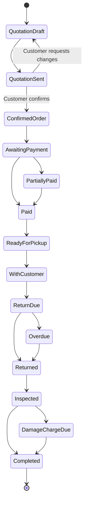

# Rental Management System

A production-oriented, hackathon-ready Rental Management System for managing the complete rental lifecycle:

**Product discovery → Quotation → Confirmation → Reservation → Payment → Invoice → Pickup → Return → Reporting**

The application supports three roles:

- **Customer:** browses products, creates quotations, confirms orders, pays, tracks rentals, and downloads invoices.
- **Vendor:** manages rentable inventory, fulfils orders, creates invoices, records pickups/returns, and tracks earnings.
- **Admin:** manages users, vendors, platform settings, taxation, permissions, and global reports.

## 1. Recommended Technology Stack

### Application
- Next.js 16 with App Router
- TypeScript with strict mode
- React Server Components by default
- Bun as package manager and runtime for scripts
- Tailwind CSS
- shadcn/ui
- Aceternity UI only for selected marketing effects
- Lucide icons

### Data and backend
- Neon PostgreSQL
- Drizzle ORM and Drizzle Kit
- Next.js Route Handlers for REST APIs
- Zod for request and environment validation
- TanStack Query for server-state mutations and client-side refresh
- Zustand only for temporary cart and checkout state
- Better Auth for authentication and sessions

### External services
- Razorpay for Indian online payments
- Resend or Nodemailer-compatible SMTP for transactional email
- Vercel Blob or S3-compatible storage for product images and generated documents
- Inngest, Trigger.dev, or a protected cron endpoint for reminders
- PDFKit, React PDF, or server-rendered HTML-to-PDF for invoices
- ExcelJS for XLSX exports

## 2. Documentation Structure

```text
my-app/
├── README.md
├── architecture.md
├── coding-standards.md
├── design-system.md
├── product.md
├── api-contract.md
├── database.md
└── agents/
    ├── frontend.md
    ├── backend.md
    ├── ai.md
    └── testing.md
```

The folder contains **eight top-level deliverables**: seven project documents and one `agents` directory. The agent directory contains four implementation briefs.

## 3. Core Rental Lifecycle



## 4. MVP Scope for a 24-Hour Hackathon

Build these paths first:

1. Customer authentication and role-aware dashboards.
2. Vendor creates and publishes a rentable product.
3. Customer browses products, selects dates, and creates a quotation.
4. Server validates availability and calculates pricing.
5. Customer confirms the quotation.
6. Server creates the rental order and reservations atomically.
7. Invoice is generated with full or partial payment support.
8. Vendor records pickup and return.
9. Inventory becomes available after completed return.
10. Admin dashboard shows revenue, active rentals, overdue rentals, and popular products.

### Stretch features
- Variant-level pricing and availability.
- Coupon codes.
- Automated email reminders.
- Razorpay webhook verification.
- Damage charges and security-deposit refunds.
- PDF/XLSX/CSV exports.
- AI-assisted support and operational summaries.

## 5. Suggested Repository Layout

```text
src/
├── app/
│   ├── (marketing)/
│   ├── (auth)/
│   ├── (portal)/
│   ├── dashboard/
│   └── api/
├── components/
│   ├── ui/
│   ├── shared/
│   ├── rental/
│   ├── billing/
│   └── dashboard/
├── db/
│   ├── schema/
│   ├── migrations/
│   ├── index.ts
│   └── seed.ts
├── features/
│   ├── auth/
│   ├── catalog/
│   ├── quotations/
│   ├── rentals/
│   ├── reservations/
│   ├── inventory/
│   ├── invoicing/
│   ├── payments/
│   ├── returns/
│   └── reporting/
├── lib/
│   ├── auth/
│   ├── payments/
│   ├── mail/
│   ├── storage/
│   ├── permissions/
│   └── validation/
├── server/
│   ├── services/
│   ├── repositories/
│   ├── jobs/
│   └── errors/
└── types/
```

## 6. Environment Variables

```bash
DATABASE_URL=
BETTER_AUTH_SECRET=
BETTER_AUTH_URL=http://localhost:3000

GITHUB_CLIENT_ID=
GITHUB_CLIENT_SECRET=

RAZORPAY_KEY_ID=
RAZORPAY_KEY_SECRET=
RAZORPAY_WEBHOOK_SECRET=

EMAIL_FROM=
RESEND_API_KEY=

APP_URL=http://localhost:3000
CRON_SECRET=
STORAGE_TOKEN=
```

Validate all variables at startup using Zod. Never access unvalidated `process.env` values throughout the application.

## 7. Local Setup

```bash
bun install
cp .env.example .env.local
bun run db:generate
bun run db:migrate
bun run db:seed
bun run dev
```

Recommended scripts:

```json
{
  "scripts": {
    "dev": "next dev",
    "build": "next build",
    "start": "next start",
    "lint": "eslint .",
    "typecheck": "tsc --noEmit",
    "test": "vitest run",
    "test:e2e": "playwright test",
    "db:generate": "drizzle-kit generate",
    "db:migrate": "drizzle-kit migrate",
    "db:studio": "drizzle-kit studio",
    "db:seed": "bun src/db/seed.ts"
  }
}
```

## 8. Demo Accounts

Seed these accounts for the judges:

```text
admin@rental.local    / Admin@123
vendor@rental.local   / Vendor@123
customer@rental.local / Customer@123
```

Use obvious demo credentials only in local or preview environments.

## 9. Definition of Done

A submission is considered functional when:

- A customer can register and log in.
- A vendor can create and publish a product.
- A customer can select a valid rental period.
- Overlapping reservations are rejected.
- A quotation can be confirmed into a rental order.
- An invoice can represent full or partial payment.
- Pickup and return actions update the rental state.
- Returned inventory becomes available again.
- Role checks are enforced on the server.
- One dashboard provides real database-backed analytics.
- Critical flows have automated tests.
