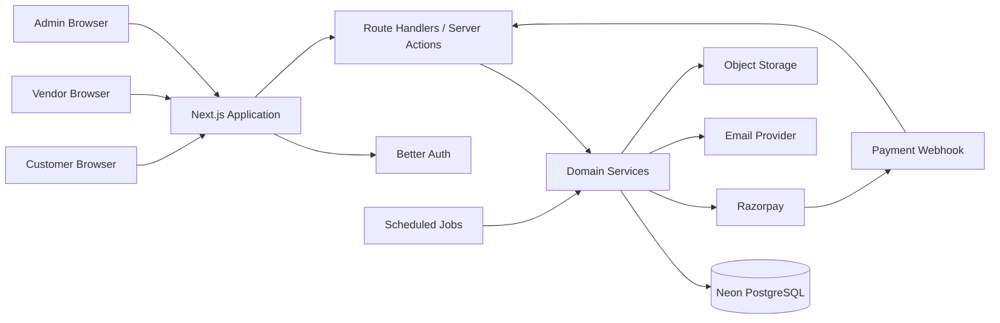

# System Architecture

## 1. Architectural Goals

The system must be:

- Correct under concurrent reservation attempts.
- Modular enough for a hackathon team to work in parallel.
- Easy to deploy as one Next.js application.
- Secure through server-side authentication and authorization.
- Auditable for financial and stock-changing operations.
- Extensible to multi-vendor and multi-location rental businesses.

A **modular monolith** is the recommended architecture. It avoids microservice overhead while preserving clear domain boundaries.

## 2. High-Level Architecture



## 3. Application Layers

### Presentation layer
Contains pages, layouts, forms, tables, dialogs, charts, and role-specific navigation.

Rules:
- Use Server Components for initial reads.
- Use Client Components for forms, interactions, charts, TanStack Query, and Zustand.
- Never put authorization logic only in the UI.
- Never call the database directly from arbitrary UI components.

### API layer
Contains Route Handlers and optional Server Actions.

Responsibilities:
- Authenticate the request.
- Validate request input.
- Call exactly one or more domain services.
- Convert domain errors to stable HTTP responses.
- Return DTOs, not raw Drizzle records when sensitive fields exist.

### Domain service layer
Contains business workflows such as:

- `createQuotation`
- `confirmQuotation`
- `checkAvailability`
- `reserveInventory`
- `createInvoice`
- `recordPayment`
- `markPickedUp`
- `processReturn`
- `calculateLateFee`
- `refundSecurityDeposit`

The service layer owns transactions and business invariants.

### Repository/data-access layer
Contains reusable queries and persistence operations. Repositories must not decide business rules.

### Integration layer
Contains Razorpay, email, storage, export, and scheduled-job adapters.

## 4. Domain Modules

```text
auth
organizations
users
vendors
customers
catalog
product-variants
pricing
quotations
rental-orders
reservations
inventory
pickups
returns
invoices
payments
coupons
notifications
reports
audit
settings
```

Each module should expose a small public surface through its service functions.

## 5. Multi-Tenancy Model

Use an `organizations` table.

- Every vendor belongs to an organization.
- Products, quotations, orders, invoices, and reports carry `organizationId`.
- Admin users can access all organizations.
- Vendor users can access only their organization.
- Customer records may interact with multiple organizations, but each rental document belongs to one organization.

Every organization-scoped query must include `organizationId` in the server-side filter.

## 6. Reservation and Overbooking Strategy

Overbooking prevention is the most important invariant.

Availability for a product variant during interval `[requestedStart, requestedEnd)` is:

```text
available =
quantityOnHand
- activeReservationsOverlappingRequestedInterval
- unavailableInventoryUnits
```

Two intervals overlap when:

```text
existing.startAt < requested.endAt
AND existing.endAt > requested.startAt
```

Use half-open intervals. A rental ending at 10:00 does not overlap one beginning at 10:00.

### Required transaction

When confirming a quotation:

1. Lock or serialize the relevant variant inventory records.
2. Recalculate current availability inside the transaction.
3. Reject the operation if requested quantity exceeds availability.
4. Insert the rental order.
5. Insert active reservations.
6. Create the draft invoice.
7. Commit all changes together.

For a hackathon, use a PostgreSQL transaction with an advisory lock per product variant or a serializable transaction with retry handling.

Pseudo-code:

```ts
await db.transaction(async (tx) => {
  await acquireVariantLocks(tx, variantIds);

  const availability = await getAvailability(tx, lines);

  assertAllAvailable(availability, lines);

  const order = await createRentalOrder(tx, quotation);
  await createReservations(tx, order);
  await createDraftInvoice(tx, order);
});
```

## 7. Pricing Architecture

Pricing is determined server-side.

Each line calculation should return:

```ts
type RentalPriceBreakdown = {
  unitBaseAmount: number;
  durationUnits: number;
  subtotal: number;
  discountAmount: number;
  taxableAmount: number;
  taxAmount: number;
  securityDepositAmount: number;
  lateFeeAmount: number;
  totalAmount: number;
};
```

Supported policies:

- Hourly
- Daily
- Weekly
- Custom-period tiers
- Variant price override
- Minimum charge
- Security deposit
- Coupon discount
- GST

Persist the calculated snapshot on quotation/order lines so historical totals do not change when product prices are edited later.

## 8. Document State Machines

### Quotation

```text
DRAFT → SENT → CONFIRMED
DRAFT → CANCELLED
SENT → EXPIRED
SENT → CANCELLED
```

### Rental order

```text
CONFIRMED → AWAITING_PAYMENT → READY_FOR_PICKUP
READY_FOR_PICKUP → WITH_CUSTOMER
WITH_CUSTOMER → RETURN_DUE → RETURNED
RETURN_DUE → OVERDUE → RETURNED
RETURNED → COMPLETED
Any allowed state → CANCELLED, subject to business rules
```

### Invoice

```text
DRAFT → ISSUED → PARTIALLY_PAID → PAID
ISSUED/PARTIALLY_PAID → OVERDUE
DRAFT/ISSUED → VOID
```

### Reservation

```text
HELD → CONFIRMED → ACTIVE → RELEASED
HELD → EXPIRED
CONFIRMED → CANCELLED
```

## 9. Security Architecture

- Better Auth session validated on the server.
- RBAC permission checks in every protected service or route.
- Organization scoping applied to all vendor data access.
- Zod validation for all untrusted input.
- Razorpay signatures verified using timing-safe comparison.
- Idempotency keys stored for webhook and payment operations.
- Password reset tokens expire and are single use.
- Rate-limit auth, quotation creation, checkout, and exports.
- Audit logs for role changes, payments, invoices, pickups, returns, and settings.
- Never trust totals submitted by the browser.
- Never expose GSTIN, addresses, or internal cost price to unauthorized users.

## 10. Reliability and Observability

Use structured logs with:

- request ID
- user ID
- organization ID
- operation
- entity ID
- duration
- outcome
- error code

Critical alerts:

- Failed payment webhook
- Reservation conflict
- Invoice total mismatch
- Repeated failed scheduled jobs
- Negative available quantity
- Return processed twice

## 11. Deployment

Recommended:

- Vercel for Next.js
- Neon PostgreSQL
- Razorpay
- Resend
- Vercel Blob
- Vercel Cron or Inngest

Production deployment checklist:

1. Run migrations before traffic.
2. Configure webhook URL and secrets.
3. Set Better Auth trusted origins.
4. Configure secure cookies and public app URL.
5. Seed only required settings, not demo users.
6. Enable database backups.
7. Test payment webhook in preview or test mode.
