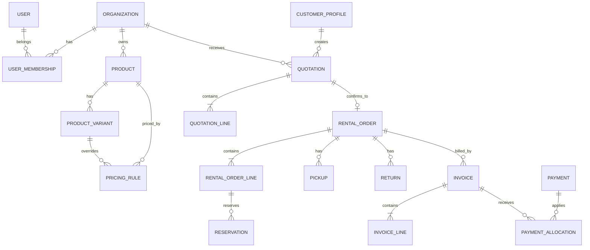

# Database Design

## 1. Database Choices

- PostgreSQL on Neon
- Drizzle ORM
- UUID primary keys
- `timestamptz` for timestamps
- Integer minor units for money
- PostgreSQL enums or validated text enums
- Soft deletion for business master data
- Immutable snapshots for financial document lines

## 2. Entity Overview



## 3. Core Enums

```ts
role: ADMIN | VENDOR | CUSTOMER

quotationStatus:
DRAFT | SENT | CONFIRMED | EXPIRED | CANCELLED

rentalOrderStatus:
CONFIRMED | AWAITING_PAYMENT | PARTIALLY_PAID | PAID |
READY_FOR_PICKUP | WITH_CUSTOMER | RETURN_DUE | OVERDUE |
RETURNED | COMPLETED | CANCELLED

reservationStatus:
HELD | CONFIRMED | ACTIVE | RELEASED | EXPIRED | CANCELLED

invoiceStatus:
DRAFT | ISSUED | PARTIALLY_PAID | PAID | OVERDUE | VOID

paymentStatus:
CREATED | PENDING | AUTHORIZED | CAPTURED | FAILED | REFUNDED | PARTIALLY_REFUNDED

pricingUnit:
HOUR | DAY | WEEK | CUSTOM

inventoryUnitStatus:
AVAILABLE | RESERVED | WITH_CUSTOMER | INSPECTION | MAINTENANCE | LOST | RETIRED
```

## 4. Identity and Organizations

### `users`
Better Auth may own part of this schema.

Important fields:
- `id`
- `name`
- `email`
- `emailVerified`
- `image`
- `createdAt`
- `updatedAt`

### `organizations`
- `id`
- `name`
- `slug`
- `legalName`
- `gstin`
- `email`
- `phone`
- `addressJson`
- `currency`
- `timezone`
- `isActive`
- timestamps

### `user_memberships`
- `id`
- `userId`
- `organizationId`, nullable for customer-only users
- `role`
- `status`
- timestamps

Unique:
- `(userId, organizationId, role)`

### `customer_profiles`
- `id`
- `userId`
- `companyName`
- `gstin`
- `phone`
- timestamps

## 5. Catalog

### `categories`
- `id`
- `organizationId`, nullable for global categories
- `name`
- `slug`
- `parentId`
- `isActive`

### `products`
- `id`
- `organizationId`
- `categoryId`
- `name`
- `slug`
- `description`
- `sku`
- `isRentable`
- `isPublished`
- `quantityOnHand`
- `costPrice`
- `salesPrice`
- `securityDeposit`
- `taxRateId`
- `deletedAt`
- timestamps

Indexes:
- `(organizationId, isPublished)`
- `(categoryId)`
- `(slug)`
- full-text or trigram index for search if needed

### `product_images`
- `id`
- `productId`
- `url`
- `altText`
- `sortOrder`

### `attributes`
- `id`
- `organizationId`
- `name`
- `code`

### `attribute_values`
- `id`
- `attributeId`
- `value`
- `sortOrder`

### `product_variants`
- `id`
- `productId`
- `sku`
- `quantityOnHand`
- `securityDeposit`
- `isActive`
- timestamps

### `product_variant_values`
- `productVariantId`
- `attributeValueId`

Unique:
- `(productVariantId, attributeValueId)`

### `pricing_rules`
- `id`
- `organizationId`
- `productId`
- `productVariantId`, nullable
- `unit`
- `unitCount`
- `price`
- `minimumUnits`
- `maximumUnits`
- `startsAt`
- `endsAt`
- `priority`
- `isActive`

## 6. Quotations

### `quotations`
- `id`
- `organizationId`
- `customerId`
- `quotationNumber`
- `status`
- `startAt`
- `endAt`
- `fulfilmentMethod`
- `billingAddressJson`
- `deliveryAddressJson`
- `couponId`
- `subtotal`
- `discountAmount`
- `taxAmount`
- `securityDepositAmount`
- `totalAmount`
- `currency`
- `expiresAt`
- `sentAt`
- `confirmedAt`
- timestamps

Unique:
- `(organizationId, quotationNumber)`

### `quotation_lines`
- `id`
- `quotationId`
- `productId`
- `productVariantId`
- `productNameSnapshot`
- `skuSnapshot`
- `descriptionSnapshot`
- `quantity`
- `startAt`
- `endAt`
- `pricingUnit`
- `durationUnits`
- `unitPrice`
- `subtotal`
- `discountAmount`
- `taxRateSnapshot`
- `taxAmount`
- `securityDepositAmount`
- `totalAmount`

## 7. Rental Orders and Reservations

### `rental_orders`
- `id`
- `organizationId`
- `customerId`
- `quotationId`
- `orderNumber`
- `status`
- `startAt`
- `endAt`
- `returnDueAt`
- `pickedUpAt`
- `returnedAt`
- all financial totals
- `currency`
- timestamps

Unique:
- `(organizationId, orderNumber)`
- `quotationId`

### `rental_order_lines`
Similar snapshot fields to quotation lines plus:
- `rentalOrderId`
- `fulfilledQuantity`
- `returnedQuantity`
- `lateFeeAmount`
- `damageChargeAmount`

### `reservations`
- `id`
- `organizationId`
- `rentalOrderId`
- `rentalOrderLineId`
- `productVariantId`
- `quantity`
- `startAt`
- `endAt`
- `status`
- timestamps

Critical index:
- `(productVariantId, startAt, endAt, status)`

A normal unique constraint cannot prevent all quantity-based overlaps. Enforce availability in a transaction.

For individually tracked assets, add `inventory_units` and reserve exact units. Then PostgreSQL exclusion constraints can prevent overlapping reservations per unit.

### Optional `inventory_units`
- `id`
- `productVariantId`
- `serialNumber`
- `assetTag`
- `status`
- `condition`
- `currentLocation`
- timestamps

### Optional `reservation_units`
- `reservationId`
- `inventoryUnitId`
- `startAt`
- `endAt`

## 8. Pickup and Return

### `pickups`
- `id`
- `rentalOrderId`
- `documentNumber`
- `status`
- `scheduledAt`
- `completedAt`
- `handledByUserId`
- `instructions`
- `customerSignatureUrl`
- timestamps

### `pickup_lines`
- `id`
- `pickupId`
- `rentalOrderLineId`
- `quantity`
- `condition`
- `notes`

### `returns`
- `id`
- `rentalOrderId`
- `documentNumber`
- `status`
- `expectedAt`
- `receivedAt`
- `inspectedAt`
- `handledByUserId`
- `lateFeeAmount`
- `damageChargeAmount`
- `depositRefundAmount`
- `notes`
- timestamps

### `return_lines`
- `id`
- `returnId`
- `rentalOrderLineId`
- `expectedQuantity`
- `returnedQuantity`
- `condition`
- `damageChargeAmount`
- `notes`

## 9. Invoices and Payments

### `invoices`
- `id`
- `organizationId`
- `customerId`
- `rentalOrderId`
- `invoiceNumber`
- `status`
- `issuedAt`
- `dueAt`
- `subtotal`
- `discountAmount`
- `taxAmount`
- `securityDepositAmount`
- `lateFeeAmount`
- `damageChargeAmount`
- `totalAmount`
- `paidAmount`
- `outstandingAmount`
- `currency`
- `supplierSnapshotJson`
- `customerSnapshotJson`
- timestamps

### `invoice_lines`
- `id`
- `invoiceId`
- `type`
- `description`
- `quantity`
- `unitPrice`
- `taxRate`
- `taxAmount`
- `lineTotal`
- `rentalOrderLineId`, nullable

### `payments`
- `id`
- `organizationId`
- `customerId`
- `gateway`
- `gatewayOrderId`
- `gatewayPaymentId`
- `gatewaySignature`
- `status`
- `amount`
- `refundedAmount`
- `currency`
- `purpose`
- `idempotencyKey`
- `paidAt`
- metadata
- timestamps

Unique:
- `gatewayPaymentId`
- `idempotencyKey` scoped appropriately

### `payment_allocations`
- `id`
- `paymentId`
- `invoiceId`
- `amount`
- timestamps

### `webhook_events`
- `id`
- `provider`
- `externalEventId`
- `eventType`
- `payloadJson`
- `status`
- `processedAt`
- `error`
- timestamps

Unique:
- `(provider, externalEventId)`

## 10. Settings and Supporting Tables

- `tax_rates`
- `rental_period_settings`
- `late_fee_policies`
- `coupons`
- `coupon_redemptions`
- `addresses`
- `notifications`
- `notification_templates`
- `audit_logs`
- `file_attachments`
- `number_sequences`

## 11. Audit Logs

### `audit_logs`
- `id`
- `organizationId`
- `actorUserId`
- `action`
- `entityType`
- `entityId`
- `beforeJson`
- `afterJson`
- `ipAddress`
- `userAgent`
- `requestId`
- `createdAt`

Audit:
- role changes
- product stock edits
- quotation confirmation
- order cancellation
- invoice issue/void
- payment/refund
- pickup
- return
- late/damage charges
- company/tax settings

## 12. Important Constraints

- All monetary values `>= 0`.
- `endAt > startAt`.
- Quantity fields `> 0`, except calculated returned quantities that may initially be 0.
- `paidAmount <= totalAmount` unless explicit overpayment support exists.
- Product and variant organization must match document organization.
- A quotation can produce at most one rental order.
- State transitions occur only through domain services.
- Referenced financial documents are never hard-deleted.

## 13. Suggested Drizzle Schema Pattern

```ts
export const money = customType<{
  data: number;
  driverData: number;
}>({
  dataType() {
    return "bigint";
  },
  fromDriver(value) {
    return Number(value);
  },
  toDriver(value) {
    return value;
  },
});
```

For amounts that may exceed JavaScript safe integers, use `bigint` in application code or a decimal library. For typical INR hackathon values, integer paise within safe limits is acceptable.

## 14. Seed Data

Seed:
- One admin
- One vendor organization
- One vendor user
- One customer
- Categories: Cameras, Audio, Furniture, Vehicles
- Three products with variants and pricing
- GST tax rate
- Default late-fee policy
- One coupon
- Sample completed and active orders for charts
